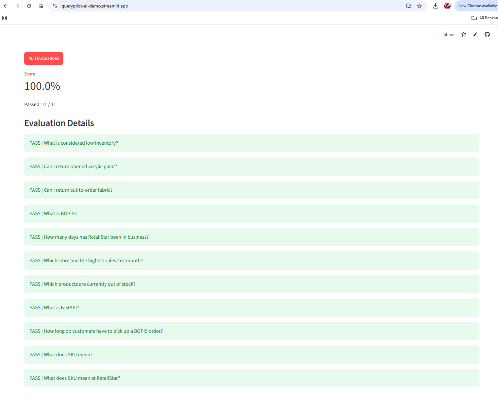

# QueryPilot AI

QueryPilot AI is an AI-powered retail analytics and knowledge assistant built with FastAPI, OpenAI, Google ADK, PostgreSQL, and pgvector.

> **Note:** RetailStar is a fictional retail company created for educational and demonstration purposes.

## Overview

QueryPilot AI allows users to ask RetailStar business and policy questions in natural language.

The project demonstrates several production-oriented AI engineering patterns, including:

- intent-based request routing
- Retrieval-Augmented Generation (RAG)
- semantic search with PostgreSQL and pgvector
- agentic tool use
- conversational context
- durable user memory
- structured evaluation and failure analysis

The system separates business knowledge from user memory: RetailStar documentation determines **what is true**, while user memory can influence **how information is explained**.

## Live Demo

QueryPilot AI is deployed with a Streamlit frontend and FastAPI backend.

- **Live Application:** https://querypilot-ai-demo.streamlit.app
- **FastAPI API:** https://querypilot-ai-8uzn.onrender.com
- **API Documentation:** https://querypilot-ai-8uzn.onrender.com/docs

> The application is hosted on cloud services and may take a few moments to wake up after a period of inactivity.

## Example Questions

Knowledge-base questions:

- What is BOPIS?
- What happens when inventory is low?
- How long are pickup orders held?
- What is the return policy?

Conversational follow-ups:

- What happens when inventory is low?
- What does that status mean?
- Who gets notified?

The application can also persist selected user context across sessions and use it to personalize future explanations.

## Architecture

QueryPilot uses a routing layer to determine how a question should be handled.

```text
User Question
     |
     v
Conversation Contextualization
     |
     v
Intent Classifier
     |
     +-------------------+--------------------+
     |                   |                    |
     v                   v                    v
 GENERAL          KNOWLEDGE_BASE          DATABASE
     |                   |                    |
   OpenAI           ADK Agent            Placeholder
                         |
                         v
               search_knowledge_base
                         |
                         v
                 PostgreSQL/pgvector
                         |
                         v
                 Grounded Response

```

The routing responsibilities are intentionally separated:

- `GENERAL` questions are answered through OpenAI.
- `KNOWLEDGE_BASE` questions are handled by the Google ADK/Gemini agent with access to the RAG retrieval tool.
- `DATABASE` questions are identified but currently return a placeholder response pending future natural-language-to-SQL support.


The DATABASE route is currently a placeholder for future natural-language-to-SQL functionality.

## Retrieval-Augmented Generation (RAG)

RetailStar business documentation is stored as Markdown files and processed through a RAG pipeline.

The pipeline:

- Loads RetailStar documentation.
- Splits documents into heading-aware chunks.
- Generates embeddings for each chunk.
- Stores embeddings in PostgreSQL using pgvector.
- Performs semantic similarity search for relevant chunks.
- Uses retrieved content as the source of truth when answering RetailStar knowledge questions.

Examples of knowledge-base documents include:

- inventory policy
- returns policy
- business glossary
- company overview
- QueryPilot user guide

Responses also expose the retrieved source documents for transparency.

## Agentic Knowledge Retrieval

QueryPilot includes a Google ADK knowledge agent with access to a real retrieval tool:

`search_knowledge_base`

For RetailStar knowledge questions, the agent can decide to call the tool, retrieve relevant information from the pgvector knowledge base, observe the result, and generate a grounded response.

The agent is instructed not to rely on general model knowledge for RetailStar-specific policies because RetailStar is fictional.

This provides a clear agent workflow:

```text
Question
   |
   v
Agent Decision
   |
   v
search_knowledge_base()
   |
   v
Retrieve Relevant Chunks
   |
   v
Observe Tool Result
   |
   v
Grounded Answer
```

The agent is integrated into the main `/ask` knowledge-base route.

For `KNOWLEDGE_BASE` requests, QueryPilot passes the contextualized question
to the ADK agent while providing durable user context through the agent
session state. The agent can invoke `search_knowledge_base`, retrieve relevant
RetailStar documentation from pgvector, and generate a grounded response.

Source documents are captured directly from the agent's tool response and returned through the `/ask` API without performing a second retrieval.

The end-to-end agent flow has been tested successfully through the FastAPI API.

## Conversation Memory

QueryPilot supports conversational follow-up questions.

Recent messages are sent with each request and used to contextualize ambiguous follow-ups before routing and retrieval.

For example:

```
User: What happens when inventory is low?
User: What does that status mean?
User: Who gets notified?
```

QueryPilot rewrites follow-up questions into standalone questions before classification and retrieval.

Conversation history is intentionally temporary and represents the current interaction rather than long-term user information.  

## Durable Memory

QueryPilot also implements durable user memory using PostgreSQL.

Unlike conversation history, durable memory survives application restarts and new chat sessions.

### What is stored?

The current implementation stores a small set of explicit, stable user facts:

- `role`
- `experience_level`

### When is memory written?

A memory extraction step evaluates the user's message before saving anything.

Only explicit, stable, and potentially useful user information is eligible for durable storage. Ordinary questions, RetailStar policy information, and inferred user characteristics are not stored.

### Where is memory stored?

Durable memories are stored in the PostgreSQL `user_memories` table.

Each memory is associated with a user and memory key, with a uniqueness constraint preventing duplicate values for the same user/key combination.

### How is memory retrieved?

Relevant durable memory is loaded during `/ask` processing and supplied as personalization context.

Memory may affect the framing or level of detail of an answer, but it is not treated as a source of truth for RetailStar policies.

In other words:

**RAG determines what is true; memory helps determine how to explain it.**

Durable memory was verified end-to-end by storing user context in PostgreSQL, restarting the FastAPI application, and sending a new request with no conversation history. QueryPilot successfully recalled the user's role and used it to personalize a grounded RetailStar response.

This verifies that long-term context comes from PostgreSQL rather than temporary conversation history or the ADK in-memory session.

### Forgetting / deletion

Explicit memory deletion is not implemented in the current capstone version.

This is intentionally left as future work so the capstone can focus on memory extraction, persistence, retrieval, and cross-session recall.

The current demo also uses a fixed demo user rather than production authentication. A production implementation would associate memories with authenticated user identities.

## Evaluation

QueryPilot includes an evaluation workflow for testing routing, retrieval,
grounded responses, source attribution, database-required questions, and
unsupported-question handling.

The golden evaluation suite contains **11 test cases** covering all three
routing paths:

- `KNOWLEDGE_BASE`
- `DATABASE`
- `GENERAL`

After integrating the Google ADK knowledge agent, durable memory, and the
final request flow, the complete regression suite was executed again.

### Final Regression Result

**11 / 11 tests passed (100%)**

The evaluation suite is exposed through the FastAPI backend and can be
executed from the Streamlit Evaluations interface.



Manual TRACE analysis was also performed across **18 traces**.

Observed failure modes were categorized into:

- Routing Failure
- Retrieval Failure
- Knowledge Base Gap
- Unsupported Answer Failure

The evaluation process identified issues in routing, knowledge coverage,
and brittle output assertions. For example, semantically correct LLM
responses can use different wording, so evaluation assertions were designed
to validate important concepts and acceptable response variants rather than
requiring a single exact sentence.

## Tech Stack

- Python
- FastAPI
- OpenAI API
- Google Agent Development Kit (ADK)
- Gemini
- PostgreSQL
- pgvector
- SQLAlchemy
- Alembic
- Pydantic
- Streamlit
- Docker

## Project Status

QueryPilot AI was developed as an AI Engineering Bootcamp capstone and is
deployed as an end-to-end working application.

### Completed

- FastAPI `/ask` endpoint
- intent classification and three-way routing
- RAG document ingestion pipeline
- PostgreSQL/pgvector semantic retrieval
- grounded RetailStar knowledge responses
- source tracking and attribution
- conversational follow-up contextualization
- durable PostgreSQL user memory
- memory extraction and upsert logic
- cross-session durable memory recall
- Google ADK/Gemini knowledge agent
- `search_knowledge_base` agent tool
- agent tool-call and tool-response workflow
- agent source propagation
- graceful knowledge-agent provider failure handling
- golden evaluation suite
- 18-trace manual TRACE analysis
- final regression evaluation: **11/11 passed (100%)**
- Streamlit application
- production PostgreSQL + pgvector database
- deployed FastAPI backend
- deployed Streamlit frontend

### Current Limitation

The `DATABASE` route identifies questions that require operational RetailStar
data but intentionally does not execute database queries yet.

For example:

> "Which store had the highest sales last month?"

is correctly routed to `DATABASE`, but QueryPilot returns a safe placeholder
instead of generating or executing SQL.

Natural-language-to-SQL is planned as a future extension.


## Planned Future Work

Potential extensions include:

- natural-language-to-SQL generation and execution
- read-only SQL validation and self-correction
- authenticated user accounts
- per-user memory isolation
- explicit memory management and deletion
- additional agent tools
- richer observability and tracing
- production-grade retry and fallback strategies
- Next.js/TypeScript frontend

## Disclaimer

RetailStar is a fictional company created solely for educational and demonstration purposes. All business data, documentation, products, policies, and scenarios in this project are fictional and do not represent any real organization.